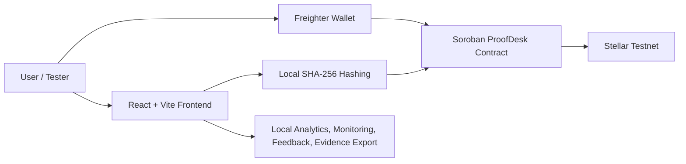
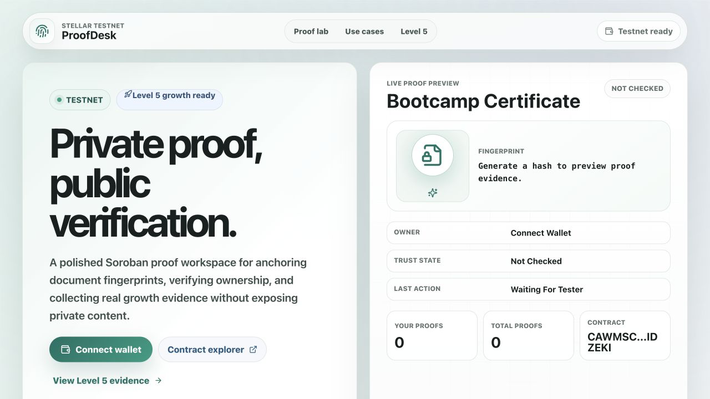
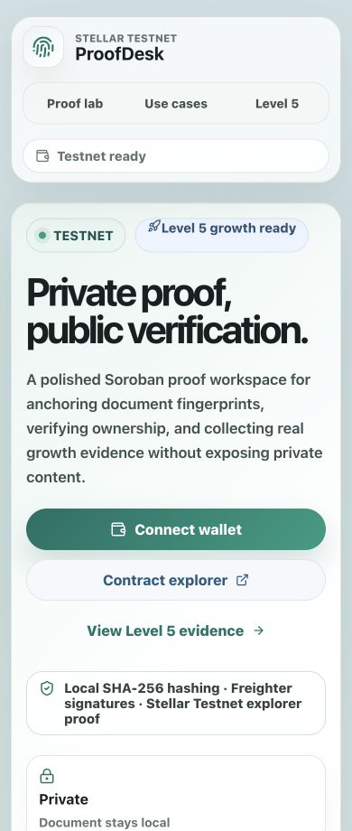
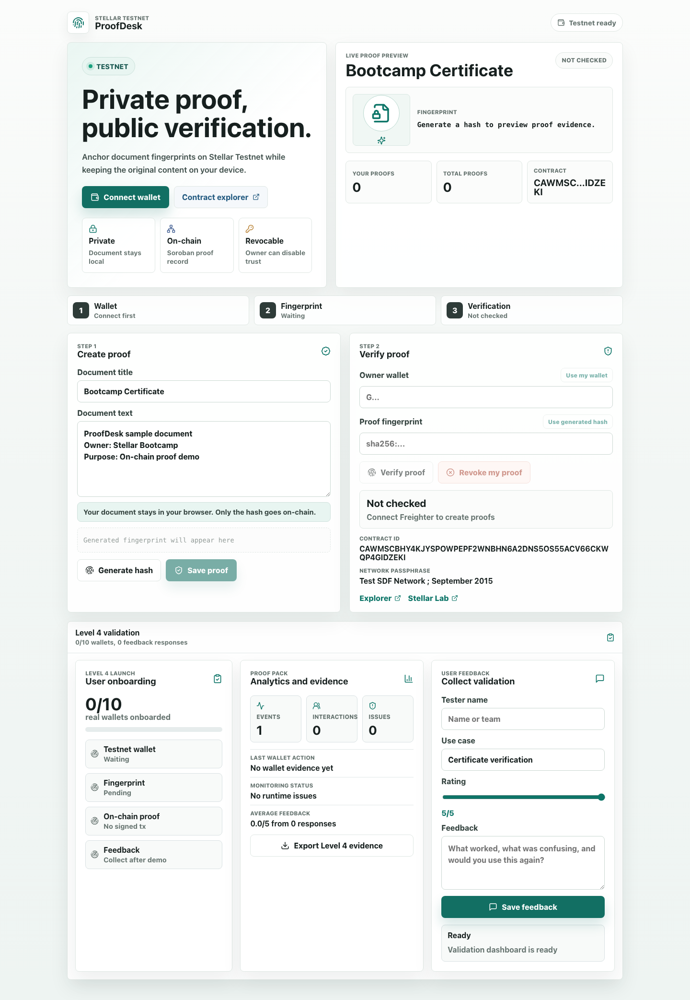

# ProofDesk Stellar

ProofDesk is a Stellar Soroban dApp for creating, revoking, and verifying on-chain document proofs with wallet-based ownership.

## Quick Links

- Live demo: <https://eliffvural.github.io/proofdesk-stellar-soroban-bootcamp/>
- Public GitHub repository: <https://github.com/eliffvural/proofdesk-stellar-soroban-bootcamp>
- Stellar Testnet contract: `CAWMSCBHY4KJYSPOWPEPF2WNBHN6A2DNS5OS55ACV66CKWQP4GIDZEKI`
- Contract explorer: <https://stellar.expert/explorer/testnet/contract/CAWMSCBHY4KJYSPOWPEPF2WNBHN6A2DNS5OS55ACV66CKWQP4GIDZEKI>
- Level 5 submission tracker: [`docs/LEVEL5_SUBMISSION.md`](docs/LEVEL5_SUBMISSION.md)
- Level 5 pitch deck/PPT: [`docs/pitch/ProofDesk_Level5_Pitch_Deck.pptx`](docs/pitch/ProofDesk_Level5_Pitch_Deck.pptx)
- Level 5 feedback Excel workbook: [`docs/evidence/proofdesk-level5-user-feedback.xlsx`](docs/evidence/proofdesk-level5-user-feedback.xlsx)
- Level 5 transaction evidence template: [`docs/evidence/level5-transaction-evidence-template.csv`](docs/evidence/level5-transaction-evidence-template.csv)
- Level 5 commit evidence: [`docs/level5/COMMIT_EVIDENCE.md`](docs/level5/COMMIT_EVIDENCE.md)
- Level 5 Google Form: `TODO: paste live Google Form URL before resubmission`
- Level 5 demo video: `TODO: paste final walkthrough URL before resubmission`

## Project Name

- ProofDesk Stellar

## About Me

- name: Elif Vural
- Building with Stellar Soroban
- Interested in proof, verification, and privacy-friendly blockchain use cases
- Creating bootcamp-ready smart contract projects with polished frontends
- Learning how to connect smart contract logic with useful product flows

## Project Details

ProofDesk lets users create tamper-resistant document proofs on Stellar Testnet. The app does not upload or store files. Instead, it creates a SHA-256 fingerprint from document text and stores that fingerprint with a title, owner wallet, timestamp, and active or revoked status in a Soroban smart contract. Anyone can verify whether a proof is valid for a specific wallet and hash. The owner can also revoke a proof if it should no longer be trusted.

## Core Features

- Connect Freighter wallet on Stellar Testnet.
- Generate a local SHA-256 fingerprint from document text.
- Save proof metadata on-chain through a Soroban smart contract.
- Verify whether a wallet-owned proof is active.
- Revoke proofs as the owner.
- View wallet proof count, total proof count, and contract links.
- Collect tester feedback in the app.
- Track privacy-friendly analytics, monitoring events, and wallet interaction evidence locally.
- Export Level 5 evidence JSON and feedback CSV for submission analysis.

## Level 5 Blue Belt Status

ProofDesk is prepared specifically for the Level 5 Blue Belt requirements: user growth, product iteration, pitch/demo readiness, and evidence collection.

| Requirement | Status | Evidence |
|---|---|---|
| Public GitHub repository | Ready | <https://github.com/eliffvural/proofdesk-stellar-soroban-bootcamp> |
| Minimum 20+ meaningful commits for Level 5 | Ready | Level 5 work has 20+ dedicated commits; see [`docs/level5/COMMIT_EVIDENCE.md`](docs/level5/COMMIT_EVIDENCE.md) |
| Live deployed application | Ready | <https://eliffvural.github.io/proofdesk-stellar-soroban-bootcamp/> |
| Pitch deck/PPT | Ready | [`docs/pitch/ProofDesk_Level5_Pitch_Deck.pptx`](docs/pitch/ProofDesk_Level5_Pitch_Deck.pptx) |
| Feedback Excel export | Ready | [`docs/evidence/proofdesk-level5-user-feedback.xlsx`](docs/evidence/proofdesk-level5-user-feedback.xlsx) |
| Google Form | Needs live URL | Use [`docs/LEVEL5_GOOGLE_FORM.md`](docs/LEVEL5_GOOGLE_FORM.md) |
| Demo video | Needs recording | Use [`docs/LEVEL5_DEMO_SCRIPT.md`](docs/LEVEL5_DEMO_SCRIPT.md) |
| Minimum 50+ testnet users | Pending real testers | Fill the feedback workbook with real responses |
| Real transaction activity | Pending real testers | Count wallets with signed `create_proof` or `revoke_proof` transactions |
| Active usage proof | Pending real testers | Add Stellar explorer transaction links and final screenshots |
| Product improvements based on feedback | Ready structure / pending real data | Improvement commits are linked below; final iteration summary should use real feedback |
| UX/UI, stability, and onboarding improvements | Ready | Level 5 interface polish, onboarding copy, validation dashboard, and evidence exports |
| Updated documentation | Ready | README plus Level 5 tracker, Google Form guide, demo script, pitch deck, and Excel workbook |
| Screenshots of analytics or transaction activity | Pending final capture | Add final screenshots after the 50+ tester cohort |

Do not fabricate the 50-user requirement. The final submission should include only real wallets, real Testnet transaction links, and real feedback.

## Level 5 Evidence Guides

- Resubmission checklist: [`docs/level5/RESUBMISSION_CHECKLIST.md`](docs/level5/RESUBMISSION_CHECKLIST.md)
- 50+ user evidence rules: [`docs/level5/USER_COHORT_EVIDENCE.md`](docs/level5/USER_COHORT_EVIDENCE.md)
- Transaction activity proof rules: [`docs/level5/TRANSACTION_ACTIVITY_PROOF.md`](docs/level5/TRANSACTION_ACTIVITY_PROOF.md)
- Google Form field map: [`docs/level5/GOOGLE_FORM_FIELD_MAP.md`](docs/level5/GOOGLE_FORM_FIELD_MAP.md)
- Excel export analysis guide: [`docs/level5/EXCEL_EXPORT_ANALYSIS.md`](docs/level5/EXCEL_EXPORT_ANALYSIS.md)
- Feedback iteration template: [`docs/level5/FEEDBACK_ITERATION_SUMMARY.md`](docs/level5/FEEDBACK_ITERATION_SUMMARY.md)
- Demo video checklist: [`docs/level5/DEMO_VIDEO_CHECKLIST.md`](docs/level5/DEMO_VIDEO_CHECKLIST.md)
- Pitch deck requirement map: [`docs/level5/PITCH_DECK_REQUIREMENT_MAP.md`](docs/level5/PITCH_DECK_REQUIREMENT_MAP.md)
- Analytics/transaction screenshot checklist: [`docs/level5/ANALYTICS_SCREENSHOT_CHECKLIST.md`](docs/level5/ANALYTICS_SCREENSHOT_CHECKLIST.md)
- Final resubmission packet: [`docs/level5/FINAL_RESUBMISSION_PACKET.md`](docs/level5/FINAL_RESUBMISSION_PACKET.md)

## Level 5 User Onboarding and Feedback Collection

Create a Google Form using [`docs/LEVEL5_GOOGLE_FORM.md`](docs/LEVEL5_GOOGLE_FORM.md). It must collect:

- Wallet address
- Email
- Name
- Testnet transaction hash or explorer URL
- Use case tested
- Product rating from 1 to 5
- Written product feedback

Export the Google Form responses to Excel and use [`docs/evidence/proofdesk-level5-user-feedback.xlsx`](docs/evidence/proofdesk-level5-user-feedback.xlsx) for analysis and record-keeping. The workbook includes a `Form Responses` sheet, `Analysis` sheet, and `Improvement Backlog` sheet.

## Level 5 Feedback-Driven Improvement Plan

Initial Level 5 product iteration:

- Commit: [`c53d1762b97e2b492f5d79be0dde23a81d612ef5`](https://github.com/eliffvural/proofdesk-stellar-soroban-bootcamp/commit/c53d1762b97e2b492f5d79be0dde23a81d612ef5)
- What changed: the in-app validation panel now targets 50 signed Testnet wallets, captures tester email, exports Level 5 JSON evidence, and exports feedback CSV.
- Why it matters: Level 5 requires larger user onboarding, active usage proof, and feedback analysis; this update turns ProofDesk into a growth-readiness workflow.

Level 5 product polish iteration:

- Commit: [`27d5bc3cc9cbdebd4aaf10d8db694a9ee3a1877a`](https://github.com/eliffvural/proofdesk-stellar-soroban-bootcamp/commit/27d5bc3cc9cbdebd4aaf10d8db694a9ee3a1877a)
- What changed: the frontend now has a stronger product landing experience, sticky section navigation, Level 5 metric cards, use-case cards, architecture storytelling, roadmap cards, a more prominent growth validation panel, and refreshed desktop/mobile screenshots.
- Why it matters: Level 5 review is not only technical; the project now presents better for testers, demo viewers, and ecosystem judges while keeping the create/verify/revoke flow clear.

Next phase improvements should be selected from the real Google Form feedback:

1. If testers struggle with wallet/Testnet setup, improve onboarding copy and add a shorter guided checklist.
2. If testers want easier verification sharing, add a shareable verification certificate or proof link.
3. If testers create multiple proofs, add proof history, saved hashes, and batch proof creation.
4. If analytics are hard to compile, add a hosted collection endpoint for feedback, monitoring, and wallet events.
5. If stability issues appear, fix the top captured monitoring errors and link each fix commit in this section.

## Level 5 Product Validation Flow

1. Ask each tester to connect a Freighter Testnet wallet.
2. Ask each tester to create or revoke at least one Testnet proof transaction.
3. Ask each tester to submit the Google Form with wallet address, email, name, rating, and written feedback.
4. Export the Google Form responses into the Excel workbook.
5. Add real wallet interaction links, analytics/transaction screenshots, and feedback summary to `docs/LEVEL5_SUBMISSION.md`.

Do not fabricate the 50-user proof requirement. Submit only real wallets, real transaction activity, and real feedback collected from testers.

## Vision

ProofDesk shows how blockchain can prove that a document existed at a specific time without exposing private document content. This can support certificates, agreements, invoices, workshop completion records, and audit trails. By storing only cryptographic fingerprints, ProofDesk keeps documents private while making verification public, transparent, and wallet-owned.

## Development Plan

1. Create Soroban storage keys for proof records, owner proof counts, total proof count, and proof status.
2. Add `create_proof(owner, proof_hash, title)` with wallet authorization and duplicate-proof protection.
3. Add verification and read functions: `verify_proof(owner, proof_hash)`, `get_proof(owner, proof_hash)`, `get_proof_count(owner)`, and `get_total_proofs()`.
4. Add `revoke_proof(owner, proof_hash)` so the owner can mark a proof as inactive without deleting the record.
5. Build the React frontend with Freighter wallet connection, local SHA-256 hashing, create proof, verify proof, revoke proof, and proof stats screens.
6. Test, build, generate TypeScript bindings, deploy the contract to Stellar Testnet, and connect the deployed contract ID to the frontend.

## Personal Story

I built ProofDesk to create a more practical smart contract project than a simple counter. It helped me understand how blockchain can verify real-world information while keeping private data off-chain. The project connects wallet authorization, hash generation, Soroban storage, and a clear frontend workflow.

## Smart Contract Functions

- `create_proof(owner, proof_hash, title)` creates a proof for the owner wallet.
- `verify_proof(owner, proof_hash)` checks if a proof exists and is active.
- `get_proof(owner, proof_hash)` returns proof metadata.
- `revoke_proof(owner, proof_hash)` marks a proof as inactive.
- `get_proof_count(owner)` returns the owner's proof count.
- `get_total_proofs()` returns total unique proofs.

## Architecture



The app keeps document content in the browser. Only the proof hash, title, owner wallet, timestamp, and active status are stored on-chain.

## Deployed Contract

- Network: Stellar Testnet
- Contract ID: `CAWMSCBHY4KJYSPOWPEPF2WNBHN6A2DNS5OS55ACV66CKWQP4GIDZEKI`
- Explorer: <https://stellar.expert/explorer/testnet/contract/CAWMSCBHY4KJYSPOWPEPF2WNBHN6A2DNS5OS55ACV66CKWQP4GIDZEKI>

## Level 5 Submission Package

The Level 5 submission tracker is in [`docs/LEVEL5_SUBMISSION.md`](docs/LEVEL5_SUBMISSION.md). It includes the required checklist, 50+ user evidence rules, Google Form requirements, feedback-driven improvement summary, growth strategy, demo flow, and final submission notes.

Supporting guides:

- [`docs/USER_TESTING_SCRIPT.md`](docs/USER_TESTING_SCRIPT.md)
- [`docs/DEPLOYMENT.md`](docs/DEPLOYMENT.md)
- [`docs/LEVEL5_SUBMISSION.md`](docs/LEVEL5_SUBMISSION.md)
- [`docs/LEVEL5_GOOGLE_FORM.md`](docs/LEVEL5_GOOGLE_FORM.md)
- [`docs/LEVEL5_DEMO_SCRIPT.md`](docs/LEVEL5_DEMO_SCRIPT.md)

## Screenshots

Desktop product UI:



Mobile responsive UI:



Analytics and monitoring panel:



## Tech Stack

- Stellar Soroban smart contract
- Rust
- React
- TypeScript
- Vite
- Freighter wallet

## Installation

Install the Soroban target:

```bash
rustup target add wasm32v1-none
```

Run contract tests:

```bash
cargo test
```

Build the contract:

```bash
stellar contract build
```

Install and build the generated TypeScript binding:

```bash
cd frontend/packages/proofdesk
npm install
npm run build
cd ../..
```

Install and run the frontend:

```bash
cd frontend
npm install
npm run dev
```

Open:

```bash
http://localhost:4325
```

## Environment Variables

Copy `frontend/.env.example` to `frontend/.env` for local overrides.

```bash
VITE_SOROBAN_RPC_URL=https://soroban-testnet.stellar.org
VITE_ANALYTICS_ENDPOINT=
VITE_FEEDBACK_ENDPOINT=
VITE_MONITORING_ENDPOINT=
```

The analytics, feedback, and monitoring endpoints are optional. When left empty, ProofDesk stores validation data locally in the browser and the evidence export still works.

## Production Deployment

The repository includes a GitHub Actions workflow at `.github/workflows/pages.yml`.
It validates the Soroban contract with Rust and Stellar CLI, builds the frontend, deploys the frontend to GitHub Pages, and includes a manual `deploy-contract-testnet` job for Stellar Testnet contract deployment when `STELLAR_TESTNET_SECRET_KEY` is configured.
After the changes are pushed to `main`, the live app should be available at:

<https://eliffvural.github.io/proofdesk-stellar-soroban-bootcamp/>

For any static host that supports Vite builds:

```bash
cd frontend
npm install
npm run build
```

Publish `frontend/dist` and set `VITE_SOROBAN_RPC_URL` to the Stellar Testnet RPC URL. After deployment, add the final demo video URL to `docs/LEVEL5_SUBMISSION.md`.

## Verification

```bash
cargo test
cd frontend
npm audit --omit=dev
npm run build
```

## Visual Concept

- Mascot: calm robot archivist
- Setting: bright verification office
- Physical keywords: validating proofs, organizing holographic documents, sealing trusted records
- Art direction: futuristic premium digital painting with glowing Stellar blockchain seals, precise proof validation, and a clean professional mood
