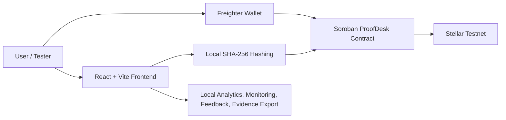

# ProofDesk Stellar

ProofDesk is a Stellar Soroban dApp for creating, revoking, and verifying on-chain document proofs with wallet-based ownership.

## Quick Links

- Live demo: <https://eliffvural.github.io/proofdesk-stellar-soroban-bootcamp/>
- Public GitHub repository: <https://github.com/eliffvural/proofdesk-stellar-soroban-bootcamp>
- Stellar Testnet contract: `CAWMSCBHY4KJYSPOWPEPF2WNBHN6A2DNS5OS55ACV66CKWQP4GIDZEKI`
- Contract explorer: <https://stellar.expert/explorer/testnet/contract/CAWMSCBHY4KJYSPOWPEPF2WNBHN6A2DNS5OS55ACV66CKWQP4GIDZEKI>
- Level 4 submission tracker: [`docs/LEVEL4_SUBMISSION.md`](docs/LEVEL4_SUBMISSION.md)

## Project Name

- ProofDesk Stellar

## About Me

- name: Elif Vural
- Building with Stellar Soroban
- Interested in proof, verification, and privacy-friendly blockchain use cases
- Creating bootcamp-ready smart contract projects with polished frontends
- Learning how to connect smart contract logic with useful product flows

## Project Details

ProofDesk lets users create tamper-resistant document proofs on Stellar Testnet. The app does not upload or store files. Instead, it creates a SHA-256 fingerprint from document text and stores that fingerprint with a title, owner wallet, timestamp, and active or revoked status in a Soroban smart contract. Anyone can verify whether a proof is valid for a specific wallet and hash. The owner can also revoke a proof if it should no longer be trusted.

## Core Features

- Connect Freighter wallet on Stellar Testnet.
- Generate a local SHA-256 fingerprint from document text.
- Save proof metadata on-chain through a Soroban smart contract.
- Verify whether a wallet-owned proof is active.
- Revoke proofs as the owner.
- View wallet proof count, total proof count, and contract links.
- Collect tester feedback in the app.
- Track privacy-friendly analytics, monitoring events, and wallet interaction evidence locally.
- Export a Level 4 evidence JSON for submission.

## Level 4 MVP Highlights

- Production-minded onboarding flow for Freighter, Testnet checks, fingerprinting, proof creation, verification, revocation, and feedback.
- Responsive React interface with loading states, disabled states, explicit error messages, and a monitored error boundary.
- Privacy-friendly analytics and monitoring event store with optional hosted endpoints.
- Exportable Level 4 evidence snapshot for wallet interactions, analytics events, monitoring issues, and feedback.
- Static deployment-ready Vite build with environment variables for RPC, analytics, feedback, and monitoring.

## Level 4 Status

| Requirement | Status |
|---|---|
| Production-ready MVP | Done |
| Stable frontend and smart contract architecture | Done |
| Mobile responsive UI | Done |
| Loading states and error handling | Done |
| Monitoring and analytics integration | Done |
| Production deployment | Done |
| Stellar Testnet contract deployment | Done |
| Public GitHub repository | Done |
| 15+ meaningful commits | Done |
| Documentation | Done |
| Product UI screenshots | Done |
| Mobile screenshots | Done |
| Analytics or monitoring screenshot | Done |
| Demo video link | Pending real recording |
| 10+ real user wallet interactions | Pending real testers |
| Basic real user feedback summary | Pending real testers |

The remaining pending items require real-world evidence and should not be fabricated.

## Product Validation Flow

1. Ask each tester to connect a Freighter Testnet wallet.
2. Create or verify at least one document proof.
3. Save one feedback response in the Level 4 Launch panel.
4. Export the Level 4 evidence JSON from the app.
5. Add real wallet interaction links and feedback summary to `docs/LEVEL4_SUBMISSION.md`.

Do not fabricate the 10-user proof requirement. Submit only real wallets and real feedback collected from testers.

## Vision

ProofDesk shows how blockchain can prove that a document existed at a specific time without exposing private document content. This can support certificates, agreements, invoices, workshop completion records, and audit trails. By storing only cryptographic fingerprints, ProofDesk keeps documents private while making verification public, transparent, and wallet-owned.

## Development Plan

1. Create Soroban storage keys for proof records, owner proof counts, total proof count, and proof status.
2. Add `create_proof(owner, proof_hash, title)` with wallet authorization and duplicate-proof protection.
3. Add verification and read functions: `verify_proof(owner, proof_hash)`, `get_proof(owner, proof_hash)`, `get_proof_count(owner)`, and `get_total_proofs()`.
4. Add `revoke_proof(owner, proof_hash)` so the owner can mark a proof as inactive without deleting the record.
5. Build the React frontend with Freighter wallet connection, local SHA-256 hashing, create proof, verify proof, revoke proof, and proof stats screens.
6. Test, build, generate TypeScript bindings, deploy the contract to Stellar Testnet, and connect the deployed contract ID to the frontend.

## Personal Story

I built ProofDesk to create a more practical smart contract project than a simple counter. It helped me understand how blockchain can verify real-world information while keeping private data off-chain. The project connects wallet authorization, hash generation, Soroban storage, and a clear frontend workflow.

## Smart Contract Functions

- `create_proof(owner, proof_hash, title)` creates a proof for the owner wallet.
- `verify_proof(owner, proof_hash)` checks if a proof exists and is active.
- `get_proof(owner, proof_hash)` returns proof metadata.
- `revoke_proof(owner, proof_hash)` marks a proof as inactive.
- `get_proof_count(owner)` returns the owner's proof count.
- `get_total_proofs()` returns total unique proofs.

## Architecture



The app keeps document content in the browser. Only the proof hash, title, owner wallet, timestamp, and active status are stored on-chain.

## Deployed Contract

- Network: Stellar Testnet
- Contract ID: `CAWMSCBHY4KJYSPOWPEPF2WNBHN6A2DNS5OS55ACV66CKWQP4GIDZEKI`
- Explorer: <https://stellar.expert/explorer/testnet/contract/CAWMSCBHY4KJYSPOWPEPF2WNBHN6A2DNS5OS55ACV66CKWQP4GIDZEKI>

## Level 4 Submission

The submission tracker is in [`docs/LEVEL4_SUBMISSION.md`](docs/LEVEL4_SUBMISSION.md). It includes the live demo/video placeholders, screenshot list, 10-user wallet evidence table, feedback summary template, and verification commands.

Supporting guides:

- [`docs/USER_TESTING_SCRIPT.md`](docs/USER_TESTING_SCRIPT.md)
- [`docs/DEPLOYMENT.md`](docs/DEPLOYMENT.md)

## Screenshots

Desktop product UI:


Mobile responsive UI:


Analytics and monitoring panel:


## Tech Stack

- Stellar Soroban smart contract
- Rust
- React
- TypeScript
- Vite
- Freighter wallet

## Installation

Install the Soroban target:

```bash
rustup target add wasm32v1-none
```

Run contract tests:

```bash
cargo test
```

Build the contract:

```bash
stellar contract build
```

Install and build the generated TypeScript binding:

```bash
cd frontend/packages/proofdesk
npm install
npm run build
cd ../..
```

Install and run the frontend:

```bash
cd frontend
npm install
npm run dev
```

Open:

```bash
http://localhost:4325
```

## Environment Variables

Copy `frontend/.env.example` to `frontend/.env` for local overrides.

```bash
VITE_SOROBAN_RPC_URL=https://soroban-testnet.stellar.org
VITE_ANALYTICS_ENDPOINT=
VITE_FEEDBACK_ENDPOINT=
VITE_MONITORING_ENDPOINT=
```

The analytics, feedback, and monitoring endpoints are optional. When left empty, ProofDesk stores validation data locally in the browser and the evidence export still works.

## Production Deployment

The repository includes a GitHub Actions workflow at `.github/workflows/pages.yml`.
It validates the Soroban contract with Rust and Stellar CLI, builds the frontend, deploys the frontend to GitHub Pages, and includes a manual `deploy-contract-testnet` job for Stellar Testnet contract deployment when `STELLAR_TESTNET_SECRET_KEY` is configured.
After the changes are pushed to `main`, the live app should be available at:

<https://eliffvural.github.io/proofdesk-stellar-soroban-bootcamp/>

For any static host that supports Vite builds:

```bash
cd frontend
npm install
npm run build
```

Publish `frontend/dist` and set `VITE_SOROBAN_RPC_URL` to the Stellar Testnet RPC URL. After deployment, add the final demo video URL to `docs/LEVEL4_SUBMISSION.md`.

## Verification

```bash
cargo test
cd frontend
npm audit --omit=dev
npm run build
```

## Visual Concept

- Mascot: calm robot archivist
- Setting: bright verification office
- Physical keywords: validating proofs, organizing holographic documents, sealing trusted records
- Art direction: futuristic premium digital painting with glowing Stellar blockchain seals, precise proof validation, and a clean professional mood
